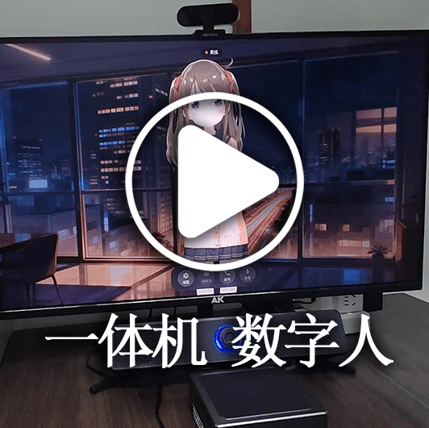
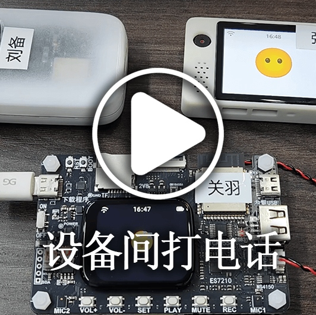
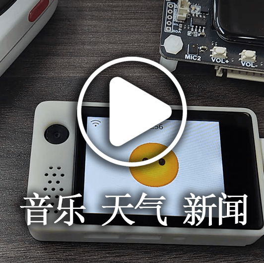

[](https://github.com/xinnan-tech/xiaozhi-esp32-server)

<h1 align="center">小智后端服务xiaozhi-esp32-server</h1>

<p align="center">
本项目基于人机共生智能理论和技术研发智能终端软硬件体系<br/>为开源智能硬件项目
<a href="https://github.com/78/xiaozhi-esp32">xiaozhi-esp32</a>提供后端服务<br/>
根据<a href="https://ccnphfhqs21z.feishu.cn/wiki/M0XiwldO9iJwHikpXD5cEx71nKh">小智通信协议</a>使用Python、Java、Vue实现<br/>
支持MQTT+UDP协议、Websocket协议、MCP接入点、声纹识别、知识库
</p>

<p align="center">
<a href="./docs/FAQ.md">常见问题</a>
· <a href="https://github.com/xinnan-tech/xiaozhi-esp32-server/issues">反馈问题</a>
· <a href="./README.md#%E9%83%A8%E7%BD%B2%E6%96%87%E6%A1%A3">部署文档</a>
· <a href="https://github.com/xinnan-tech/xiaozhi-esp32-server/releases">更新日志</a>
</p>

<p align="center">
  <a href="./README.md"></a>
  <a href="./docs/readme/README_en.md"></a>
  <a href="./docs/readme/README_vi.md"></a>
  <a href="./docs/readme/README_de.md"></a>
  <a href="./docs/readme/README_pt_BR.md"></a>
  <a href="https://github.com/xinnan-tech/xiaozhi-esp32-server/releases">
    
  </a>
  <a href="https://github.com/xinnan-tech/xiaozhi-esp32-server/blob/main/LICENSE">
    
  </a>
  <a href="https://github.com/xinnan-tech/xiaozhi-esp32-server">
    
  </a>
</p>

<p align="center">
Spearheaded by Professor Siyuan Liu's Team (South China University of Technology)
</br>
刘思源教授团队主导研发（华南理工大学）
</br>

</p>

---

## 适用人群 👥

本项目需要配合 ESP32 硬件设备使用。如果您已经购买了 ESP32 相关硬件，且成功对接过虾哥部署的后端服务，并希望独立搭建自己的
`xiaozhi-esp32` 后端服务，那么本项目非常适合您。

想看使用效果？请猛戳视频 🎥

<table>
  <tr>
    <td>
      <a href="https://www.bilibili.com/video/BV1FMFyejExX" target="_blank">
        <picture>
          </picture>
      </a>
    </td>
    <td>
      <a href="https://www.bilibili.com/video/BV1vchQzaEse" target="_blank">
        <picture>
          </picture>
      </a>
    </td>
    <td>
      <a href="https://www.bilibili.com/video/BV1WEcxzFEAT" target="_blank">
        <picture>
          </picture>
      </a>
    </td>
    <td>
      <a href="https://www.bilibili.com/video/BV1CKVz6UEuB" target="_blank">
        <picture>
          </picture>
      </a>
    </td>
    <td>
      <a href="https://www.bilibili.com/video/BV1C1tCzUEZh" target="_blank">
        <picture>
          </picture>
      </a>
    </td>
  </tr>
  <tr>
    <td>
      <a href="https://www.bilibili.com/video/BV1VC96Y5EMH" target="_blank">
        <picture>
          </picture>
      </a>
    </td>
    <td>
      <a href="https://www.bilibili.com/video/BV12J7WzBEaH" target="_blank">
        <picture>
          </picture>
      </a>
    </td>
    <td>
      <a href="https://www.bilibili.com/video/BV1Co76z7EvK" target="_blank">
        <picture>
          </picture>
      </a>
    </td>
    <td>
      <a href="https://www.bilibili.com/video/BV1pNXWYGEx1" target="_blank">
        <picture>
          </picture>
      </a>
    </td>
    <td>
      <a href="https://www.bilibili.com/video/BV1TJ7WzzEo6" target="_blank">
        <picture>
          </picture>
      </a>
    </td>
  </tr>
  <tr>
    <td>
      <a href="https://www.bilibili.com/video/BV1ZQKUzYExM" target="_blank">
        <picture>
          </picture>
      </a>
    </td>
    <td>
      <a href="https://www.bilibili.com/video/BV1zUW5zJEkq" target="_blank">
        <picture>
          </picture>
      </a>
    </td>
    <td>
      <a href="https://www.bilibili.com/video/BV1Exu3zqEDe" target="_blank">
        <picture>
          </picture>
      </a>
    </td>
    <td>
      <a href="https://www.bilibili.com/video/BV1CDKWemEU6" target="_blank">
        <picture>
          </picture>
      </a>
    </td>
    <td>
      <a href="https://www.bilibili.com/video/BV12yA2egEaC" target="_blank">
        <picture>
          </picture>
      </a>
    </td>
  </tr>
</table>

---

## 警告 ⚠️

1、本项目为开源软件，本软件与对接的任何第三方API服务商（包括但不限于语音识别、大模型、语音合成等平台）均不存在商业合作关系，不为其服务质量及资金安全提供任何形式的担保。
建议使用者优先选择持有相关业务牌照的服务商，并仔细阅读其服务协议及隐私政策。本软件不托管任何账户密钥、不参与资金流转、不承担充值资金损失风险。

2、本项目功能未完善，且未通过网络安全测评，请勿在生产环境中使用。 如果您在公网环境中部署学习本项目，请务必做好必要的防护。

---

## 部署文档


本项目提供两种部署方式，请根据您的具体需求选择：

#### 🚀 部署方式选择
| 部署方式 | 特点 | 适用场景 | 部署文档 | 配置要求 | 视频教程 | 
|---------|------|---------|---------|---------|---------|
| **最简化安装** | 智能对话、单智能体管理 | 低配置环境，数据存储在配置文件，无需数据库 | [①Docker版](./docs/Deployment.md#%E6%96%B9%E5%BC%8F%E4%B8%80docker%E5%8F%AA%E8%BF%90%E8%A1%8Cserver) / [②源码部署](./docs/Deployment.md#%E6%96%B9%E5%BC%8F%E4%BA%8C%E6%9C%AC%E5%9C%B0%E6%BA%90%E7%A0%81%E5%8F%AA%E8%BF%90%E8%A1%8Cserver)| 如果使用`FunASR`要2核4G，如果全API，要2核2G | - | 
| **全模块安装** | 智能对话、多用户管理、多智能体管理、智控台界面操作 | 完整功能体验，数据存储在数据库 |[①Docker版](./docs/Deployment_all.md#%E6%96%B9%E5%BC%8F%E4%B8%80docker%E8%BF%90%E8%A1%8C%E5%85%A8%E6%A8%A1%E5%9D%97) / [②源码部署](./docs/Deployment_all.md#%E6%96%B9%E5%BC%8F%E4%BA%8C%E6%9C%AC%E5%9C%B0%E6%BA%90%E7%A0%81%E8%BF%90%E8%A1%8C%E5%85%A8%E6%A8%A1%E5%9D%97) / [③源码部署自动更新教程](./docs/dev-ops-integration.md) | 如果使用`FunASR`要4核8G，如果全API，要2核4G| [本地源码启动视频教程](https://www.bilibili.com/video/BV1wBJhz4Ewe) | 

常见问题及相关教程，可参考[这个链接](./docs/FAQ.md)

> 💡 提示：以下是按最新代码部署后的测试平台，有需要可烧录测试，并发为6个，每天会清空数据，

```
智控台地址: https://2662r3426b.vicp.fun
智控台(h5版): https://2662r3426b.vicp.fun/h5/index.html

服务测试工具： https://2662r3426b.vicp.fun/test/
OTA接口地址: https://2662r3426b.vicp.fun/xiaozhi/ota/

---

## 项目目录结构与技术栈

### 整体架构

xiaozhi-esp32-server 采用 **分布式、多组件协作** 的架构设计，各组件职责清晰，可独立开发、测试和部署。

```
┌─────────────────────────────────────────────────────────────────────────────┐
│                           xiaozhi-esp32-server                              │
│                                                                             │
│  ┌──────────┐    ┌────────────┐    ┌─────────────┐    ┌───────────────┐    │
│  │  ESP32   │◄──►│ xiaozhi-   │◄──►│ manager-api │◄──►│ manager-web   │    │
│  │  硬件设备 │    │ server     │    │ (Java后端)   │    │ (Vue控制台)    │    │
│  │          │    │ (AI引擎)    │    └─────────────┘    └───────────────┘    │
│  └──────────┘    │ Python:8000 │         │                                  │
│       │          └────────────┘         │                                  │
│       │                  │              │                                  │
│       ▼                  ▼              ▼                                  │
│  ┌──────────┐    ┌────────────┐    ┌─────────────┐                         │
│  │ digital- │    │  AI服务     │    │  MySQL /    │                         │
│  │ human    │    │ (ASR/LLM/  │    │  Redis      │                         │
│  │ 数字人    │    │  TTS等)    │    │  数据库       │                         │
│  └──────────┘    └────────────┘    └─────────────┘                         │
│                                                                             │
│  ┌──────────────────────────────────────────────────────────────────┐       │
│  │  manager-mobile (uni-app跨端移动管理端)                           │       │
│  └──────────────────────────────────────────────────────────────────┘       │
└─────────────────────────────────────────────────────────────────────────────┘
```

### 端口分配

| 组件 | 端口 | 协议 | 说明 |
|------|------|------|------|
| xiaozhi-server | 8000 | WebSocket | 与 ESP32 设备实时通信 |
| xiaozhi-server | 8003 | HTTP | OTA 升级、视觉分析 API |
| manager-web | 8001 | HTTP | Web 管理控制台 |
| manager-api | 8002 | HTTP | 管理后端 RESTful API |

---

### 整体目录结构

```
xiaozhi-esp32-server/
├── main/                              # 主代码目录
│   ├── xiaozhi-server/                # 核心AI引擎 (Python)
│   ├── manager-api/                   # 管理后端 (Java Spring Boot)
│   ├── manager-web/                   # Web管理控制台 (Vue 2)
│   ├── manager-mobile/                # 移动端管理 (uni-app + Vue 3)
│   └── digital-human/                 # 数字人测试模块 (Python + Web)
├── docs/                              # 文档目录
│   ├── readme/                        # 多语言 README 文件
│   ├── images/                        # 文档图片资源
│   └── *.md                           # 各类集成 & 部署文档
├── .github/                           # GitHub CI/CD 配置
│   ├── workflows/                     # Docker 镜像构建流水线
│   └── ISSUE_TEMPLATE/                # Issue 模板
├── Dockerfile-server                  # 服务端 Docker 镜像
├── Dockerfile-server-base             # 服务端基础 Docker 镜像
├── Dockerfile-web                     # Web 前端 Docker 镜像
├── docker-setup.sh                    # Docker 部署脚本
├── .dockerignore
└── README.md                          # 项目说明文档
```

---

### 技术栈一览

| 组件 | 语言/框架 | 技术要点 |
|------|-----------|----------|
| **xiaozhi-server** | Python 3.10+ | WebSocket (websockets库), asyncio, aiohttp, loguru, opuslib, numpy |
| **manager-api** | Java 21, Spring Boot 3.4 | MyBatis-Plus, Apache Shiro, MySQL, Redis, Liquibase, Knife4j, Druid |
| **manager-web** | Vue 2 + Element UI | vue-router, vuex, vue-i18n, flyio, workbox (PWA), sass |
| **manager-mobile** | uni-app 3 + Vue 3 + Vite | alova, pinia, 支持 App/微信小程序/H5 |
| **digital-human** | Python + Live2D + Pixi.js | WebSocket, asyncio, aiohttp, Sherpa-ONNX (唤醒词) |

---

### 各模块详解

---

#### 1. xiaozhi-server — 核心AI引擎

**目录结构：**

```
xiaozhi-server/
├── app.py                         # 程序入口，启动 WebSocket + HTTP 服务
├── config.yaml                    # 默认配置文件
├── config_from_api.yaml           # 智控台配置模板
├── agent-base-prompt.txt          # Agent 基础系统提示词
├── requirements.txt               # Python 依赖列表
├── docker-compose.yml             # Docker Compose 部署
├── docker-compose_all.yml         # 全模块 Docker Compose
│
├── config/                        # 配置层
│   ├── config_loader.py           # 配置加载器（支持本地文件 + 远程API拉取）
│   ├── logger.py                  # 日志配置（基于loguru）
│   ├── settings.py                # 全局设置读取
│   ├── manage_api_client.py       # 连接智控台的API客户端
│   └── assets/                    # 静态音频资源
│       ├── wakeup_words.wav       # 唤醒词提示音
│       ├── bind_code.wav          # 绑定码提示音
│       ├── tts_notify.mp3         # TTS结束提示音
│       └── ...
│
├── core/                          # 核心业务逻辑
│   ├── connection.py              # 【核心枢纽】ConnectionHandler，管理完整对话会话
│   ├── websocket_server.py        # WebSocket 服务器，负责设备连接和消息路由
│   ├── http_server.py             # HTTP 服务器，提供 OTA 升级和视觉分析接口
│   ├── auth.py                    # JWT 认证管理
│   │
│   ├── handle/                    # 各类消息处理器
│   │   ├── receiveAudioHandle.py  # 接收并处理音频数据（VAD检测 + 语音识别入口）
│   │   ├── sendAudioHandle.py     # 发送TTS音频到设备（流控、MQTT网关）
│   │   ├── textHandle.py          # 文本消息路由（分发到对应处理器）
│   │   ├── textMessageHandler.py  # 消息处理器抽象基类
│   │   ├── textMessageProcessor.py    # 消息处理编排
│   │   ├── textMessageHandlerRegistry.py  # 处理器注册表
│   │   ├── textMessageType.py     # 消息类型定义
│   │   ├── helloHandle.py         # 握手/初始化处理器
│   │   ├── intentHandler.py       # 用户意图识别与处理
│   │   ├── abortHandle.py         # 打断处理
│   │   ├── reportHandle.py        # 上报处理器（ASR/TTS/工具调用状态上报）
│   │   └── textHandler/           # 具体文本消息类型处理
│   │       ├── helloMessageHandler.py    # 握手消息
│   │       ├── listenMessageHandler.py   # 监听模式控制
│   │       ├── iotMessageHandler.py      # IoT设备描述
│   │       ├── mcpMessageHandler.py      # MCP工具协议
│   │       ├── abortMessageHandler.py    # 打断
│   │       ├── pingMessageHandler.py     # 心跳保活
│   │       └── serverMessageHandler.py   # 服务端消息
│   │
│   ├── providers/                 # AI 服务提供商（插件化架构）
│   │   ├── vad/                   # 语音活动检测
│   │   │   ├── base.py            #   抽象基类
│   │   │   └── silero.py          #   Silero VAD 实现（基于ONNX）
│   │   ├── asr/                   # 语音识别（支持10+提供商）
│   │   │   ├── base.py            #   抽象基类 + 音频队列处理
│   │   │   ├── aliyun.py          #   阿里云语音识别（非流式）
│   │   │   ├── aliyun_stream.py   #   阿里云实时语音识别（流式）
│   │   │   ├── aliyunbl_stream.py #   阿里百炼流式ASR
│   │   │   ├── baidu.py           #   百度语音识别
│   │   │   ├── doubao.py          #   豆包语音识别
│   │   │   ├── doubao_stream.py   #   豆包流式ASR
│   │   │   ├── tencent.py         #   腾讯云语音识别
│   │   │   ├── xunfei_stream.py   #   讯飞流式ASR
│   │   │   ├── openai.py          #   OpenAI Whisper API
│   │   │   ├── qwen3_asr_flash.py #   通义千问ASR
│   │   │   ├── fun_local.py       #   本地 FunASR
│   │   │   ├── fun_server.py      #   远程 FunASR 服务
│   │   │   ├── sherpa_onnx_local.py # 本地 Sherpa-ONNX ASR
│   │   │   └── vosk.py            #   Vosk 本地ASR
│   │   ├── llm/                   # 大语言模型（支持10+提供商）
│   │   │   ├── base.py            #   抽象基类
│   │   │   ├── openai.py          #   OpenAI 兼容接口
│   │   │   ├── ollama.py          #   Ollama 本地LLM
│   │   │   ├── gemini.py          #   Google Gemini
│   │   │   ├── dify.py            #   Dify 平台
│   │   │   ├── coze.py            #   扣子 Coze
│   │   │   ├── fastgpt.py         #   FastGPT
│   │   │   ├── xinference.py      #   Xorbits Inference
│   │   │   ├── homeassistant.py   #   Home Assistant 智能家居
│   │   │   └── AliBL/             #   阿里百炼
│   │   ├── tts/                   # 语音合成（支持20+提供商）
│   │   │   ├── base.py            #   抽象基类 + 音频队列、流控、替换词
│   │   │   ├── edge.py            #   Microsoft Edge TTS
│   │   │   ├── openai.py          #   OpenAI TTS
│   │   │   ├── aliyun.py          #   阿里云TTS
│   │   │   ├── aliyun_stream.py   #   阿里云流式TTS
│   │   │   ├── alibl_stream.py    #   阿里百炼流式TTS
│   │   │   ├── doubao.py          #   豆包TTS
│   │   │   ├── tencent.py         #   腾讯云TTS
│   │   │   ├── xunfei_stream.py   #   讯飞流式TTS
│   │   │   ├── huoshan_double_stream.py # 火山引擎双流式TTS
│   │   │   ├── fishspeech.py      #   Fish Speech
│   │   │   ├── gpt_sovits_v2.py   #   GPT-SoVITS v2
│   │   │   ├── gpt_sovits_v3.py   #   GPT-SoVITS v3
│   │   │   ├── minimax_httpstream.py  # MiniMax
│   │   │   ├── siliconflow.py     #   硅基流动
│   │   │   ├── index_stream.py    #   Index Stream
│   │   │   ├── paddle_speech.py   #   飞桨语音合成
│   │   │   ├── cozecn.py          #   扣子国内版TTS
│   │   │   ├── custom.py          #   自定义TTS
│   │   │   └── default.py         #   默认TTS实现
│   │   ├── intent/                # 意图识别
│   │   │   ├── base.py            #   抽象基类
│   │   │   ├── function_call/     #   基于Function Calling的意图
│   │   │   ├── intent_llm/        #   基于LLM的意图分析
│   │   │   └── nointent/          #   不启用意图识别
│   │   ├── memory/                # 记忆管理
│   │   │   ├── base.py            #   抽象基类
│   │   │   ├── nomem/             #   无记忆模式
│   │   │   ├── mem_local_short/   #   本地短期记忆
│   │   │   ├── mem_report_only/   #   仅报告记忆
│   │   │   ├── mem0ai/            #   Mem0AI 长期记忆
│   │   │   └── powermem/          #   PowerMem 记忆服务
│   │   ├── tools/                 # 工具/函数调用
│   │   │   ├── base/              #   工具基础框架（类型、执行器、定义）
│   │   │   ├── device_iot/        #   IoT设备控制工具
│   │   │   ├── device_mcp/        #   MCP客户端工具
│   │   │   ├── server_plugins/    #   服务端插件工具
│   │   │   ├── server_mcp/        #   服务端MCP管理
│   │   │   └── mcp_endpoint/      #   MCP接入点
│   │   │   └── unified_tool_handler.py  # 统一工具调用处理器
│   │   │   └── unified_tool_manager.py  # 统一工具管理器
│   │   └── vllm/                  # 视觉大模型
│   │       ├── base.py            #   抽象基类
│   │       └── openai.py          #   OpenAI视觉接口
│   │
│   ├── utils/                     # 工具类库
│   │   ├── modules_initialize.py  #   全局模块初始化（VAD/ASR/LLM/TTS/Memory/Intent）
│   │   ├── dialogue.py            #   对话管理（Message + Dialogue）
│   │   ├── util.py                #   通用工具（IP获取、音频编解码、敏感信息过滤等）
│   │   ├── auth.py                #   认证工具
│   │   ├── asr.py                 #   ASR模块工厂函数
│   │   ├── llm.py                 #   LLM模块工厂函数
│   │   ├── tts.py                 #   TTS工具（Markdown清理、百分比转换）
│   │   ├── intent.py              #   Intent模块工厂函数
│   │   ├── memory.py              #   Memory模块工厂函数
│   │   ├── vad.py                 #   VAD模块工厂函数
│   │   ├── vllm.py                #   VLLM模块工厂函数
│   │   ├── p3.py                  #   音频处理工具（PCM/PCMU/G711编解码）
│   │   ├── textUtils.py           #   文本处理工具
│   │   ├── prompt_manager.py      #   提示词管理
│   │   ├── context_provider.py    #   上下文提供者
│   │   ├── opus_encoder_utils.py  #   Opus编码工具
│   │   ├── audioRateController.py #   音频流控器
│   │   ├── output_counter.py      #   输出计数控制
│   │   ├── voiceprint_provider.py #   声纹识别提供者
│   │   ├── wakeup_word.py         #   唤醒词配置管理
│   │   ├── current_time.py        #   当前时间工具
│   │   └── gc_manager.py          #   全局GC管理器
│   │
│   ├── api/                       # HTTP API接口
│   │   ├── base_handler.py        #   API基类
│   │   ├── ota_handler.py         #   OTA固件升级接口
│   │   └── vision_handler.py      #   视觉分析接口（MCP）
│   │
│   ├── models/                    # 本地AI模型
│   │   ├── SenseVoiceSmall/       #   阿里SenseVoice语音识别模型
│   │   └── snakers4_silero-vad/   #   Silero VAD语音活动检测模型
│   │
│   ├── plugins_func/              # 插件系统（服务端插件）
│   │   ├── register.py            #   插件注册机制（Action枚举、ActionResponse、FunctionItem）
│   │   ├── loadplugins.py         #   插件自动加载器
│   │   └── functions/             #   具体插件实现
│   │       ├── get_weather.py             # 天气查询
│   │       ├── get_time.py                # 时间查询
│   │       ├── web_search.py              # 网络搜索
│   │       ├── play_music.py              # 播放音乐
│   │       ├── get_news_from_newsnow.py   # NewsNow新闻
│   │       ├── get_news_from_chinanews.py # 中国新闻网
│   │       ├── search_from_ragflow.py     # RAGFlow知识库检索
│   │       ├── change_role.py             # 切换角色
│   │       ├── handle_exit_intent.py      # 退出意图处理
│   │       ├── hass_init.py              # Home Assistant初始化
│   │       ├── hass_get_state.py         # HA获取状态
│   │       ├── hass_set_state.py         # HA设置状态
│   │       └── hass_play_music.py        # HA播放音乐
│   │
│   └── performance_tester/        # 性能测试工具
│       ├── performance_tester.py          # 主入口
│       ├── performance_tester_asr.py      # ASR性能测试
│       ├── performance_tester_llm.py      # LLM性能测试
│       ├── performance_tester_tts.py      # TTS性能测试
│       ├── performance_tester_vllm.py     # VLLM性能测试
│       ├── performance_tester_stream_asr.py   # 流式ASR性能测试
│       └── performance_tester_stream_tts.py   # 流式TTS性能测试
```

**核心数据流：**

```
ESP32 → WebSocket音频 → VAD检测 → ASR语音识别 → LLM文本生成
    ↓                                                      ↓
    └──────────── TTS语音合成 ← 意图识别/工具调用 ←─────────┘
         ↓
    WebSocket音频回传 → ESP32播放
```

---

#### 2. manager-api — Java管理后端

**目录结构：**

```
manager-api/
├── pom.xml                                    # Maven项目配置
├── src/main/java/xiaozhi/
│   ├── AdminApplication.java                  # Spring Boot 启动入口
│   ├── common/                                # 公共模块
│   │   ├── dao/BaseDao.java                   #   数据访问基类
│   │   ├── page/PageData.java                 #   分页数据封装
│   │   ├── page/TokenDTO.java                 #   Token数据传输对象
│   │   ├── utils/                             #   工具类
│   │   │   ├── AESUtils.java                  #     AES加解密
│   │   │   ├── SM2Utils.java                  #     国密SM2算法
│   │   │   ├── IpUtils.java                   #     IP工具
│   │   │   ├── Result.java                    #     统一API响应
│   │   │   ├── ToolUtil.java                  #     通用工具
│   │   │   └── TreeNode.java                  #     树结构工具
│   │   └── xss/                               #   XSS安全过滤
│   │       ├── SqlFilter.java                 #     SQL注入过滤
│   │       ├── XssConfig.java                 #     XSS配置
│   │       ├── XssFilter.java                 #     XSS过滤器
│   │       └── XssUtils.java                  #     XSS工具
├── src/main/resources/
│   ├── application.yml                        #   应用配置
│   ├── application-dev.yml                    #   开发环境配置
│   ├── logback-spring.xml                     #   Logback日志配置
│   ├── db/changelog/                          #   Liquibase数据库变更
│   │   ├── 202503141335.sql                   #    数据库初始表结构
│   │   ├── ...                                #    迭代更新SQL
│   │   └── 202506010920.sql                   #    最新变更
│   ├── mapper/                                #   MyBatis XML映射
│   │   ├── agent/                             #    智能体相关
│   │   └── device/                            #    设备相关
│   └── lua/                                   #   Redis Lua脚本
│       ├── emptyAll.lua                       #     清空Redis
│       └── getKeyOrCreate.lua                 #     获取或创建Key
```

**核心能力：**
- 用户认证（Shiro + JWT）和权限管理
- ESP32设备注册、管理、OTA固件管理
- AI服务提供商（ASR/LLM/TTS）配置管理
- 智能体（Agent）模板 & 角色管理
- 系统参数、字典管理、多语言国际化
- 声纹识别管理、音色克隆管理
- 知识库 & RAGFlow 集成
- 替换词管理、功能特性开关

---

#### 3. manager-web — Vue.js Web管理控制台

**技术特点：**
- 基于 Vue 2 + Element UI 的单页应用（SPA）
- 国际化支持（中/英/德/葡/越）
- PWA 支持（Service Worker + 离线访问）
- 使用 flyio 进行HTTP请求封装
- 使用 sm-crypto 进行国密SM2加解密

**主要视图：**

| 视图文件 | 功能说明 |
|----------|----------|
| views/login.vue | 用户登录页 |
| views/register.vue | 用户注册页 |
| views/retrievePassword.vue | 密码找回 |
| views/home.vue | 首页（设备/智能体概览） |
| views/DeviceManagement.vue | 设备管理 |
| views/AgentTemplateManagement.vue | 智能体模板管理 |
| views/ModelConfig.vue | AI模型配置（ASR/LLM/TTS） |
| views/ProviderManagement.vue | 服务提供商管理 |
| views/VoiceResourceManagement.vue | 语音资源管理 |
| views/VoicePrint.vue | 声纹识别管理 |
| views/VoiceCloneManagement.vue | 音色克隆管理 |
| views/KnowledgeBaseManagement.vue | 知识库管理 |
| views/KnowledgeFileUpload.vue | 知识文件上传 |
| views/OtaManagement.vue | OTA固件升级管理 |
| views/ParamsManagement.vue | 系统参数配置 |
| views/DictManagement.vue | 字典管理 |
| views/FeatureManagement.vue | 功能特性管理 |
| views/RoleConfig.vue | 角色配置 |
| views/UserManagement.vue | 用户管理 |
| views/TemplateQuickConfig.vue | 快速配置向导 |
| views/ReplacementWordManagement.vue | 替换词管理 |
| views/ServerSideManager.vue | 服务端管理 |

---

#### 4. manager-mobile — uni-app跨端移动管理端

**技术特点：**
- 基于 uni-app 3 + Vue 3 + Vite + TypeScript
- 跨平台：Android / iOS / 微信小程序 / H5
- 使用 alova 请求库 + @alova/adapter-uniapp
- 使用 pinia 进行状态管理
- 国际化支持（中/英/德/葡/越）

**主要目录：**

```
manager-mobile/
├── src/
│   ├── api/                          # API封装层
│   │   ├── auth.ts                   #   认证相关接口
│   │   ├── agent/                    #   智能体相关
│   │   ├── device/                   #   设备相关
│   │   ├── chat-history/             #   对话历史
│   │   └── voiceprint/               #   声纹相关
│   ├── components/                   # 通用组件
│   │   └── custom-tabs/              #   自定义标签页
│   ├── hooks/                        # 组合式函数
│   │   ├── usePageAuth.ts            #   页面鉴权
│   │   ├── useRequest.ts             #   请求封装
│   │   └── useUpload.ts             #   上传封装
│   ├── http/                         # HTTP请求层
│   │   └── request/                  #   alova适配
│   ├── i18n/                         # 国际化配置
│   ├── layouts/                      # 布局组件
│   ├── App.vue                       # 应用根组件
│   └── env.d.ts                      # TypeScript声明
├── pages.config.ts                   # 页面路由配置
├── manifest.config.ts                # 应用清单配置
└── env/                              # 环境变量
    ├── .env.development              #   开发环境
    ├── .env.production               #   生产环境
    └── .env.test                     #   测试环境
```

---

#### 5. digital-human — 数字人测试模块

**目录结构：**

```
digital-human/
├── start.py                          # 启动入口（HTTP服务器 + 唤醒词运行时）
├── index.html                        # 数字人交互测试页面
├── favicon.ico                       # 网站图标
├── README.md                         # 模块说明
│
├── css/
│   ├── index.css                     # 测试页面样式
│   └── bg.png                        # 背景图片
│
├── js/
│   ├── app.js                        # 主应用入口（初始化所有子系统）
│   ├── config/                       # 前端配置
│   │   ├── manager.js                #   管理配置
│   │   └── default-mcp-tools.json    #   默认MCP工具配置
│   ├── core/                         # 核心功能
│   │   ├── audio/                    # 音频处理
│   │   │   ├── opus-codec.js         #   Opus音频编解码
│   │   │   ├── player.js             #   音频播放器
│   │   │   ├── recorder.js           #   音频录制器
│   │   │   └── stream-context.js     #   音频流上下文
│   │   ├── mcp/tools.js              #   MCP工具前端交互
│   │   └── network/                  # 网络通信
│   │       ├── websocket.js          #   WebSocket客户端
│   │       ├── ota-connector.js      #   OTA连接器
│   │       └── wakeword-bridge.js    #   唤醒词桥接
│   ├── live2d/                       # Live2D模型渲染
│   │   ├── live2d.js                 #   Live2D管理器
│   │   ├── pixi.js                   #   Pixi.js渲染引擎
│   │   ├── cubism4.min.js            #   Cubism 4 SDK
│   │   └── live2dcubismcore.min.js   #   Cubism Core引擎
│   ├── ui/                           # UI层
│   │   ├── controller.js             #   UI控制器
│   │   └── background-load.js        #   后台加载管理
│   └── utils/                        # 工具
│       ├── logger.js                 #   前端日志
│       ├── libopus.js                #   Opus库加载器
│       └── blocking-queue.js         #   阻塞队列实现
│
├── images/                           # 页面用图
│
├── resources/                        # Live2D模型资源
│   ├── hiyori_pro_zh/                #   小夜模型（中文）
│   └── natori_pro_zh/                #   名取模型（中文）
│
└── wakeword_runtime/                 # 本地唤醒词运行时（Python）
    ├── __init__.py
    ├── config.json                   # 运行时配置
    ├── requirements.txt              # Python依赖
    ├── config/                       # 运行时配置模块
    │   ├── config_loader.py          #   配置加载
    │   └── logging_setup.py          #   日志设置
    ├── core/                         # 核心检测
    │   ├── detector.py               #   唤醒词检测器
    │   ├── detector_assets.py        #   检测器资源管理
    │   └── microphone.py             #   麦克风音频采集
    ├── bridge/                       # 事件桥
    │   └── event_bridge.py           #   WebSocket事件桥（通知前端唤醒）
    ├── plugins/                      # 插件
    │   ├── base.py                   #   插件基类
    │   ├── manager.py                #   插件管理器
    │   ├── audio.py                  #   音频插件
    │   └── wake_word.py              #   唤醒词插件
    └── runtime/                      # 运行时
        ├── app.py                    #   TestRuntimeApplication
        └── http_server.py            #   TestRuntimeHttpServer
```

**核心能力：**
- 数字人交互测试页面（Web端）
- 基于Live2D + Pixi.js的3D虚拟角色渲染
- 本地唤醒词检测（基于Sherpa-ONNX）
- WebSocket事件桥，连接前端与唤醒词运行时
- 音频采集、编解码、播放全链路

---
Websocket接口地址: wss://2662r3426b.vicp.fun/xiaozhi/v1/
```

#### 🚩 配置说明和推荐
> [!Note]
> 本项目提供两种配置方案：
> 
> 1. `入门全免费`配置：适合个人家庭使用，所有组件均采用免费方案，无需额外付费。
> 
> 2. `流式配置`：适合演示、培训、超过2个并发等场景，采用流式处理技术，响应速度更快，体验更佳。
> 
> 自`0.5.2`版本起，项目支持流式配置，相比早期版本，响应速度提升约`2.5秒`，显著改善用户体验。

| 模块名称 | 入门全免费设置 | 流式配置 |
|:---:|:---:|:---:|
| ASR(语音识别) | FunASR(本地) | 👍XunfeiStreamASR(讯飞流式) |
| LLM(大模型) | glm-4-flash(智谱) | 👍qwen-flash(阿里百炼) |
| VLLM(视觉大模型) | glm-4v-flash(智谱) | 👍qwen3.5-flash(阿里百炼) |
| TTS(语音合成) | EdgeTTS(微软) | 👍HuoshanDoubleStreamTTS(火山流式) |
| Intent(意图识别) | function_call(函数调用) | function_call(函数调用) |
| Memory(记忆功能) | mem_local_short(本地短期记忆） | mem_local_short（本地短期记忆） |

如果您关心各组件的耗时，请查阅[小智各组件性能测试报告](https://github.com/xinnan-tech/xiaozhi-performance-research)，可按报告中的测试方法在您的环境中实际测试。

#### 🔧 测试工具
本项目提供以下测试工具，帮助您验证系统和选择合适的模型：

| 工具名称 | 位置 | 使用方法 | 功能说明 |
|:---:|:---|:---:|:---:|
| 音频交互测试工具 | main》digital-human》index.html | 在 `main/digital-human` 执行 `python start.py` 后访问 `http://127.0.0.1:8006/index.html` | 测试音频播放和接收功能，验证Python端音频处理是否正常 |
| 模型响应测试工具 | main》xiaozhi-server》performance_tester.py | 执行 `python performance_tester.py` | 测试ASR(语音识别)、LLM(大模型)、VLLM(视觉模型)、TTS(语音合成)三个核心模块的响应速度 |

> 💡 提示：测试模型速度时，只会测试配置了密钥的模型。

---
## 功能清单 ✨
### 已实现 ✅

| 功能模块 | 描述 |
|:---:|:---|
| 核心架构 | 基于[MQTT+UDP网关](https://github.com/xinnan-tech/xiaozhi-esp32-server/blob/main/docs/mqtt-gateway-integration.md)、WebSocket、HTTP服务器，提供完整的控制台管理和认证系统 |
| 语音交互 | 支持流式ASR(语音识别)、流式TTS(语音合成)、VAD(语音活动检测)，支持多语言识别和语音处理 |
| 声纹识别 | 支持多用户声纹注册、管理和识别，与ASR并行处理，实时识别说话人身份并传递给LLM进行个性化回应 |
| 智能对话 | 支持多种LLM(大语言模型)，实现智能对话 |
| 视觉感知 | 支持多种VLLM(视觉大模型)，实现多模态交互 |
| 意图识别 | 支持外挂的大模型意图识别、大模型自主函数调用，提供插件化意图处理机制 |
| 记忆系统 | 支持本地短期记忆、mem0ai接口记忆、PowerMem智能记忆，具备记忆总结功能 |
| 知识库 | 支持RAGFlow知识库，让大模型判断需要调度知识库后再回答 |
| 工具调用 | 支持客户端IOT协议、客户MCP协议、服务端MCP协议、MCP接入点协议、自定义工具函数 |
| 指令下发 | 依托MQTT协议，支持从智控台将MCP指令下发到ESP32设备 |
| 管理后台 | 提供Web管理界面，支持用户管理、系统配置和设备管理；界面支持中文简体、中文繁体、英文显示 |
| 测试工具 | 提供性能测试工具、视觉模型测试工具和音频交互测试工具 |
| 部署支持 | 支持Docker部署和本地部署，提供完整的配置文件管理 |
| 插件系统 | 支持功能插件扩展、自定义插件开发和插件热加载 |

### 正在开发 🚧

想了解具体开发计划进度，[请点击这里](https://github.com/users/xinnan-tech/projects/3)。常见问题及相关教程，可参考[这个链接](./docs/FAQ.md)

如果你是一名软件开发者，这里有一份[《致开发者的公开信》](docs/contributor_open_letter.md)，欢迎加入！

---

## 产品生态 👬
小智是一个生态，当你使用这个产品时，也可以看看其他在这个生态圈的[优秀项目](https://github.com/78/xiaozhi-esp32/blob/main/README_zh.md#%E7%9B%B8%E5%85%B3%E5%BC%80%E6%BA%90%E9%A1%B9%E7%9B%AE)

---

## 本项目支持的平台/组件列表 📋
### LLM 语言模型

| 使用方式 | 支持平台 | 免费平台 |
|:---:|:---:|:---:|
| openai 接口调用 | 阿里百炼、火山引擎、DeepSeek、智谱、Gemini、科大讯飞 | 智谱、Gemini |
| ollama 接口调用 | Ollama | - |
| dify 接口调用 | Dify | - |
| fastgpt 接口调用 | Fastgpt | - |
| coze 接口调用 | Coze | - |
| xinference 接口调用 | Xinference | - |
| homeassistant 接口调用 | HomeAssistant | - |

实际上，任何支持 openai 接口调用的 LLM 均可接入使用。

---

### VLLM 视觉模型

| 使用方式 | 支持平台 | 免费平台 |
|:---:|:---:|:---:|
| openai 接口调用 | 阿里百炼、智谱ChatGLMVLLM | 智谱ChatGLMVLLM |

实际上，任何支持 openai 接口调用的 VLLM 均可接入使用。

---

### TTS 语音合成

| 使用方式 | 支持平台 | 免费平台 |
|:---:|:---:|:---:|
| 接口调用 | EdgeTTS、科大讯飞、火山引擎、腾讯云、阿里云及百炼、CosyVoiceSiliconflow、TTS302AI、CozeCnTTS、GizwitsTTS、ACGNTTS、OpenAITTS、灵犀流式TTS、MinimaxTTS | 灵犀流式TTS、EdgeTTS、CosyVoiceSiliconflow(部分) |
| 本地服务 | FishSpeech、GPT_SOVITS_V2、GPT_SOVITS_V3、Index-TTS、PaddleSpeech | Index-TTS、PaddleSpeech、FishSpeech、GPT_SOVITS_V2、GPT_SOVITS_V3 |

---

### VAD 语音活动检测

| 类型  |   平台名称    | 使用方式 | 收费模式 | 备注 |
|:---:|:---------:|:----:|:----:|:--:|
| VAD | SileroVAD | 本地使用 |  免费  |    |

---

### ASR 语音识别

| 使用方式 | 支持平台 | 免费平台 |
|:---:|:---:|:---:|
| 本地使用 | FunASR、SherpaASR | FunASR、SherpaASR |
| 接口调用 | FunASRServer、火山引擎、科大讯飞、腾讯云、阿里云、百度云、OpenAI ASR | FunASRServer |

---

### Voiceprint 声纹识别

| 使用方式 | 支持平台 | 免费平台 |
|:---:|:---:|:---:|
| 本地使用 | 3D-Speaker | 3D-Speaker |

---

### Memory 记忆存储

|   类型   |      平台名称       | 使用方式 |   收费模式    | 备注 |
|:------:|:---------------:|:----:|:---------:|:--:|
| Memory |     mem0ai      | 接口调用 | 1000次/月额度 |    |
| Memory |     [powermem](./docs/powermem-integration.md)    | 本地总结 | 取决于LLM和DB |  OceanBase开源，支持智能检索  |
| Memory | mem_local_short | 本地总结 |    免费     |    |
| Memory |     nomem       | 无记忆模式 |    免费     |    |

---

### Intent 意图识别

|   类型   |     平台名称      | 使用方式 |  收费模式   |          备注           |
|:------:|:-------------:|:----:|:-------:|:---------------------:|
| Intent |  intent_llm   | 接口调用 | 根据LLM收费 |    通过大模型识别意图，通用性强     |
| Intent | function_call | 接口调用 | 根据LLM收费 | 通过大模型函数调用完成意图，速度快，效果好 |
| Intent |    nointent   | 无意图模式 |    免费     |    不进行意图识别，直接返回对话结果     |

---

### Rag 检索增强生成

|   类型   |     平台名称      | 使用方式 |  收费模式   |          备注           |
|:------:|:-------------:|:----:|:-------:|:---------------------:|
| Rag |  ragflow   | 接口调用 | 根据切片、分词消耗的token收费 |    借助RagFlow的检索增强生成功能，提供更准确的对话回复     |

---

## 鸣谢 🙏

| Logo | 项目/公司 | 说明 |
|:---:|:---:|:---|
|  | [百聆语音对话机器人](https://github.com/wwbin2017/bailing) | 本项目受[百聆语音对话机器人](https://github.com/wwbin2017/bailing)启发，并在其基础上实现 |
|  | [十方融海](https://www.tenclass.com/) | 感谢[十方融海](https://www.tenclass.com/)为小智生态制定了标准的通讯协议、多设备兼容性方案及高并发场景实践示范；为本项目提供了全链路技术文档支持 |
|  | [玄凤科技](https://github.com/Eric0308) | 感谢[玄凤科技](https://github.com/Eric0308)贡献函数调用框架、MCP通信协议及插件化调用机制的实现代码，通过标准化的指令调度体系与动态扩展能力，显著提升了前端设备(IoT)的交互效率和功能延展性 |
|  | [huangjunsen](https://github.com/huangjunsen0406) | 感谢[huangjunsen](https://github.com/huangjunsen0406) 贡献`智控台移动端`模块，实现了跨平台移动设备的高效控制与实时交互，大幅提升了系统在移动场景下的操作便捷性和管理效率 |
|  | [汇远设计](http://ui.kwd988.net/) | 感谢[汇远设计](http://ui.kwd988.net/)为本项目提供专业视觉解决方案，用其服务超千家企业的设计实战经验，赋能本项目产品用户体验 |
|  | [西安勤人信息科技](https://www.029app.com/) | 感谢[西安勤人信息科技](https://www.029app.com/)深化本项目视觉体系，确保整体设计风格在多场景应用中的一致性和扩展性 |
|  | [代码贡献者](https://github.com/xinnan-tech/xiaozhi-esp32-server/graphs/contributors) | 感谢[所有代码贡献者](https://github.com/xinnan-tech/xiaozhi-esp32-server/graphs/contributors)贡献者，你们的付出让项目更加健壮和强大。 |


<a href="https://star-history.com/#xinnan-tech/xiaozhi-esp32-server&Date">

 <picture>
   <source media="(prefers-color-scheme: dark)" srcset="https://api.star-history.com/svg?repos=xinnan-tech/xiaozhi-esp32-server&type=Date&theme=dark" />
   <source media="(prefers-color-scheme: light)" srcset="https://api.star-history.com/svg?repos=xinnan-tech/xiaozhi-esp32-server&type=Date" />
   
 </picture>
</a>